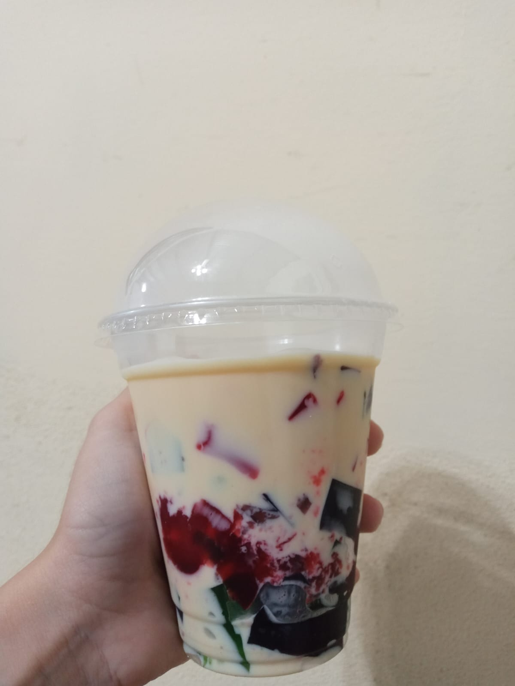
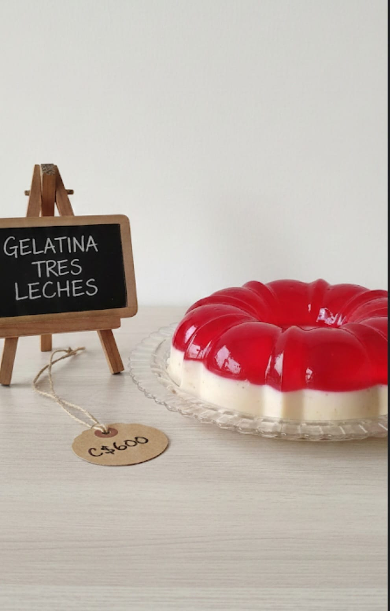
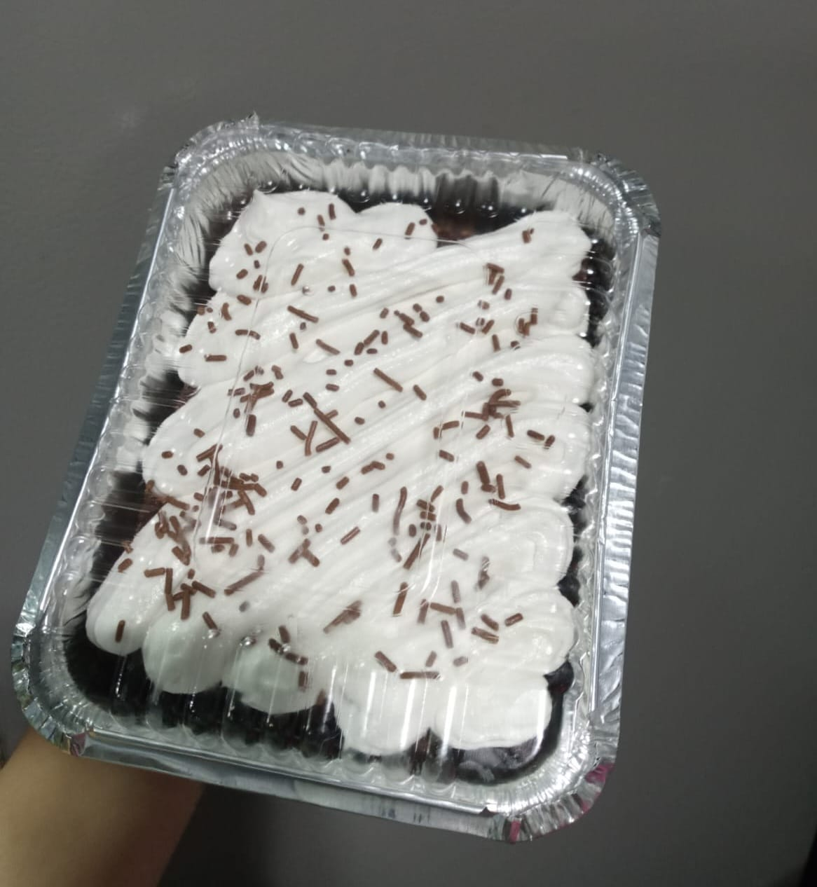
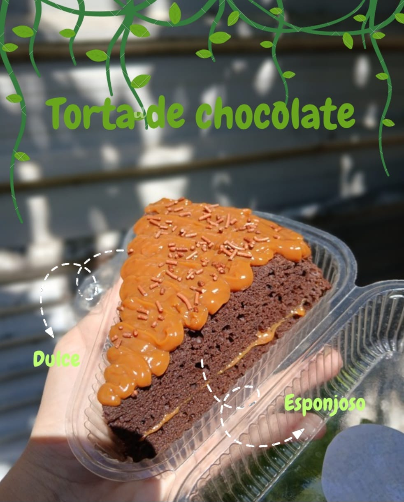
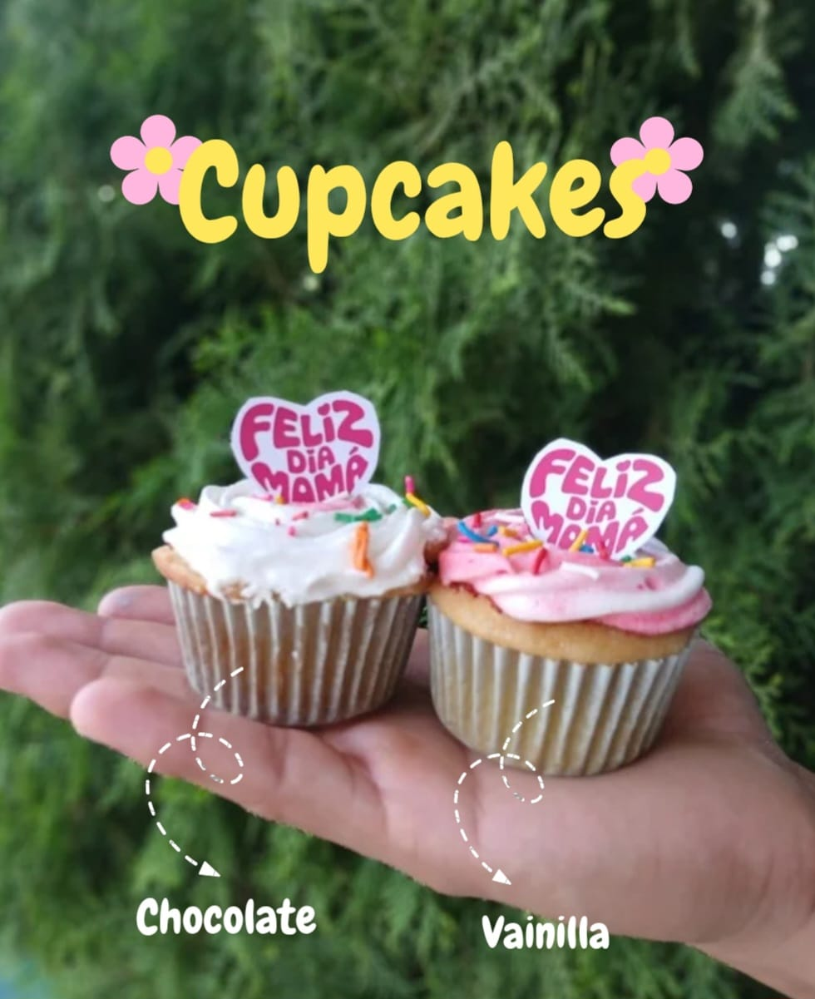
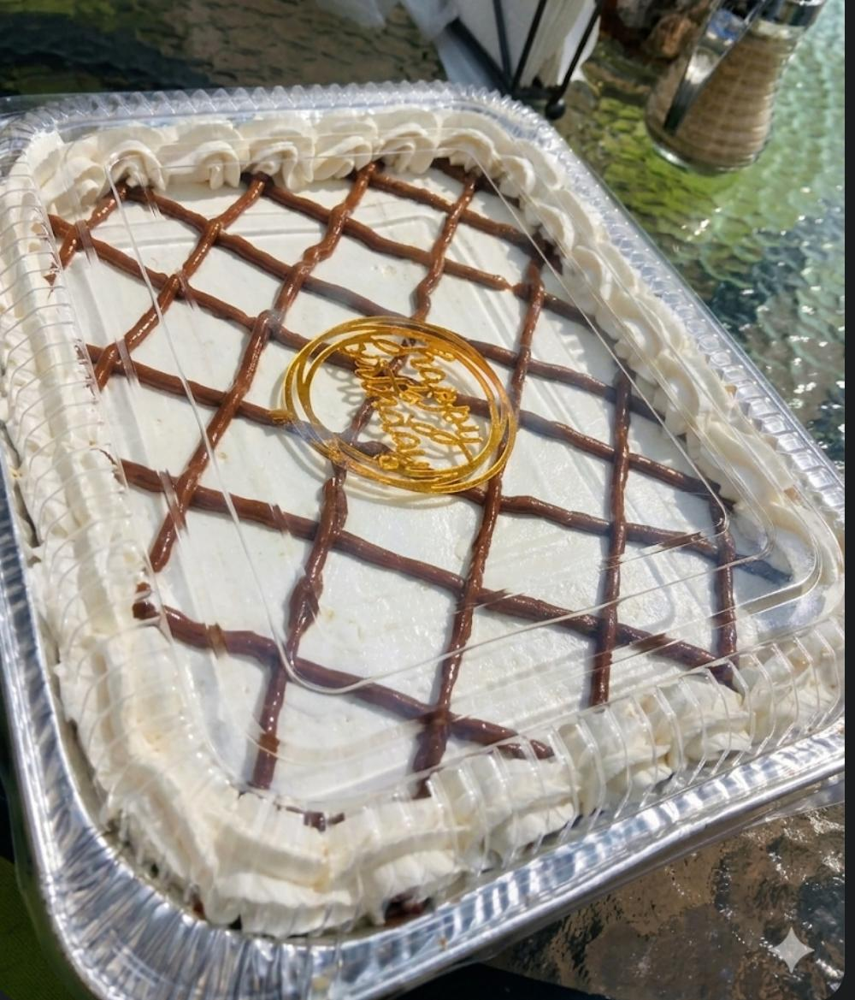
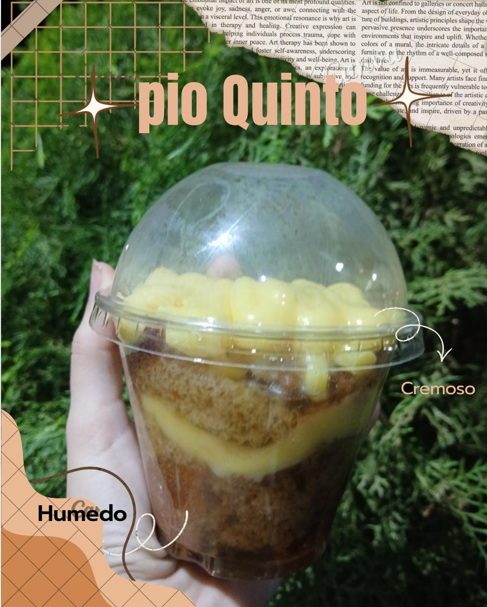
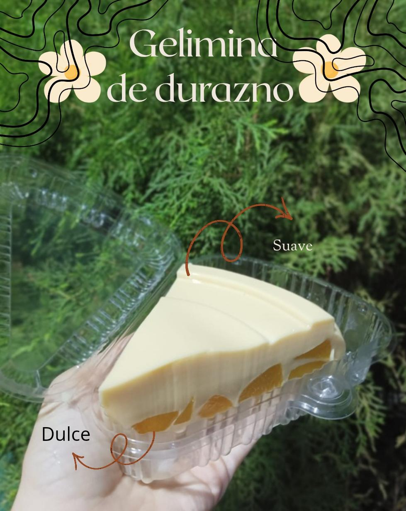

<!DOCTYPE html>
<html lang="es">
<head>
    <meta charset="UTF-8">
    <meta name="viewport" content="width=device-width, initial-scale=1.0">
    <title>Wassby Sweet - Catálogo Oficial</title>
    
    <!-- Fuentes Elegantes de Google -->
    <link rel="preconnect" href="https://fonts.googleapis.com">
    <link rel="preconnect" href="https://fonts.gstatic.com" crossorigin>
    <link href="https://fonts.googleapis.com/css2?family=Montserrat:wght@400;500;600;700&family=Playfair+Display:ital,wght@0,400;0,600;0,700;1,400&family=Dancing+Script:wght@600&display=swap" rel="stylesheet">
    
    <!-- Íconos Premium FontAwesome -->
    <link rel="stylesheet" href="https://cdnjs.cloudflare.com/ajax/libs/font-awesome/6.4.0/css/all.min.css">

    
</head>
<body>

    <!-- BOTÓN FLOTANTE DE WHATSAPP -->
    <a href="https://wa.me/50585140940" class="floating-wpp" target="_blank" rel="noopener noreferrer" title="Escríbenos directamente">
        <i class="fa-brands fa-whatsapp"></i>
    </a>

    <!-- ENCABEZADO -->
    <header class="header">
        

            
        

        
REPOSTERÍA ARTESANAL · MANAGUA, NICARAGUA

        <h1 class="brand-name">Wassby Sweet</h1>
        
“ Un pedacito de cielo en cada bocado. ”

    </header>

    <!-- INTRODUCCIÓN -->
    <section class="intro-section">
        
— Nuestro Menú

        <h2 class="intro-title">Endulzamos tus momentos</h2>
        
Toca <strong>Pedir ahora</strong> o <strong>Consultar precio</strong> y te atendemos directo por WhatsApp. Hacemos pedidos personalizados.

    </section>

    <!-- BARRA INTERACTIVA DE CATEGORÍAS -->
    <nav class="categories-container">
        

            <i class="fa-solid fa-cookie"></i> Todos 15
        

        

            <i class="fa-solid fa-ice-cream"></i> Postres en Vaso 7
        

        

            <i class="fa-solid fa-cake-candles"></i> Tortas 5
        

        

            <i class="fa-solid fa-mug-hot"></i> Cupcakes 1
        

        

            <i class="fa-solid fa-heart"></i> Tradicional / Gelatinas 2
        

    </nav>

    <!-- GRILLA DE PRODUCTOS -->
    <main class="products-grid">
        
        <!-- Producto 1 -->
        <article class="product-card" data-category="vaso">
            

                
                
C$110

            

            

                <h3 class="product-title">Mosaico</h3>
                
Capas de felicidad listas para alegrar tu día en una presentación práctica.

                <a href="https://wa.me/50585140940?text=Hola!%20Quiero%20ordenar%20un%20Mosaico" class="btn-order" target="_blank" rel="noopener noreferrer">
                    <i class="fa-brands fa-whatsapp"></i> Pedir ahora
                </a>
            

        </article>

        <!-- Producto 2 -->
        <article class="product-card" data-category="tradicional">
            

                
                
C$600

            

            

                <h3 class="product-title">Gelatina Tres Leches</h3>
                
La suavidad perfecta hecha postre. El toque elegante y tradicional para compartir en familia.

                <a href="https://wa.me/50585140940?text=Hola!%20Quiero%20ordenar%20una%20Gelatina%20Tres%20Leches" class="btn-order" target="_blank" rel="noopener noreferrer">
                    <i class="fa-brands fa-whatsapp"></i> Pedir ahora
                </a>
            

        </article>

        <!-- Producto 3 -->
        <article class="product-card" data-category="tortas">
            

                
                
C$120

            

            

                <h3 class="product-title">Torta de Atolillo</h3>
                
Un clásico espectacular con el sabor of casa y un toque exquisito de canela.

                <a href="https://wa.me/50585140940?text=Hola!%20Quiero%20ordenar%20una%20Torta%20de%20Atolillo" class="btn-order" target="_blank" rel="noopener noreferrer">
                    <i class="fa-brands fa-whatsapp"></i> Pedir ahora
                </a>
            

        </article>

        <!-- Producto 4 -->
        <article class="product-card" data-category="tortas">
            

                
                
C$150

            

            

                <h3 class="product-title">Torta de Chocolate con Crema</h3>
                
Deliciosa base húmeda de chocolate cubierta con abundante y suave crema.

                <a href="https://wa.me/50585140940?text=Hola!%20Quiero%20ordenar%20una%20Torta%20de%20Chocolate%20con%20Crema" class="btn-order" target="_blank" rel="noopener noreferrer">
                    <i class="fa-brands fa-whatsapp"></i> Pedir ahora
                </a>
            

        </article>

        <!-- Producto 5 -->
        <article class="product-card" data-category="tortas">
            

                
                
C$150

            

            

                <h3 class="product-title">Torta de Piña</h3>
                
Esponjosa y jugosa torta con el inconfundible sabor dulce y tropical de la piña.

                <a href="https://wa.me/50585140940?text=Hola!%20Quiero%20ordenar%20una%20Torta%20de%20Piña" class="btn-order" target="_blank" rel="noopener noreferrer">
                    <i class="fa-brands fa-whatsapp"></i> Pedir ahora
                </a>
            

        </article>

        <!-- Producto 6 -->
        <article class="product-card" data-category="vaso">
            

                
                
C$100

            

            

                <h3 class="product-title">Tres Leches de Chocolate</h3>
                
La fusión perfecta del tradicional tres leches con el irresistible y decadente sabor a chocolate.

                <a href="https://wa.me/50585140940?text=Hola!%20Quiero%20ordenar%20un%20Tres%20Leches%20de%20Chocolate" class="btn-order" target="_blank" rel="noopener noreferrer">
                    <i class="fa-brands fa-whatsapp"></i> Pedir ahora
                </a>
            

        </article>

        <!-- Producto 7 -->
        <article class="product-card" data-category="tortas">
            

                
                
C$70

            

            

                <h3 class="product-title">Torta de Chocolate (Porción)</h3>
                
Extremadamente dulce y esponjosa, finamente decorada con exquisito dulce de leche.

                <a href="https://wa.me/50585140940?text=Hola!%20Quiero%20ordenar%20una%20Porción%20de%20Torta%20de%20Chocolate" class="btn-order" target="_blank" rel="noopener noreferrer">
                    <i class="fa-brands fa-whatsapp"></i> Pedir ahora
                </a>
            

        </article>

        <!-- Producto 8 -->
        <article class="product-card" data-category="cupcakes">
            

                
            

            

                <h3 class="product-title">Cupcakes Especiales</h3>
                
Detalles llenos de amor. Disponibles en deliciosos sabores clásicos: Vainilla y Chocolate.

                <a href="https://wa.me/50585140940?text=Hola!%20Quiero%20consultar%20precios%20de%20los%20Cupcakes%20Especiales" class="btn-order" target="_blank" rel="noopener noreferrer">
                    <i class="fa-brands fa-whatsapp"></i> Consultar precio
                </a>
            

        </article>

        <!-- Producto 9 -->
        <article class="product-card" data-category="vaso">
            

                
                
C$60

            

            

                <h3 class="product-title">Torta de Mermelada de Piña</h3>
                
Capas de bizcocho suave intercaladas con una deliciosa y fresca mermelada de piña.

                <a href="https://wa.me/50585140940?text=Hola!%20Quiero%20ordenar%20una%20Torta%20de%20Mermelada%20de%20Piña" class="btn-order" target="_blank" rel="noopener noreferrer">
                    <i class="fa-brands fa-whatsapp"></i> Pedir ahora
                </a>
            

        </article>

        <!-- Producto 10 -->
        <article class="product-card" data-category="vaso">
            

                
                
C$60

            

            

                <h3 class="product-title">Torta con Mermelada de Fresa</h3>
                
El postre perfecto para llevar, combinando el mejor bizcocho con una dulce mermelada de fresa.

                <a href="https://wa.me/50585140940?text=Hola!%20Quiero%20ordenar%20una%20Torta%20con%20Mermelada%20de%20Fresa" class="btn-order" target="_blank" rel="noopener noreferrer">
                    <i class="fa-brands fa-whatsapp"></i> Pedir ahora
                </a>
            

        </article>

        <!-- Producto 11 -->
        <article class="product-card" data-category="vaso">
            

                
                
C$90

            

            

                <h3 class="product-title">Mousse de Maracuyá</h3>
                
Deliciosa textura increíblemente cremosa con el equilibrio perfecto entre dulce y el toque cítrico del maracuyá.

                <a href="https://wa.me/50585140940?text=Hola!%20Quiero%20ordenar%20un%20Mousse%20de%20Maracuyá" class="btn-order" target="_blank" rel="noopener noreferrer">
                    <i class="fa-brands fa-whatsapp"></i> Pedir ahora
                </a>
            

        </article>

        <!-- Producto 12 -->
        <article class="product-card" data-category="vaso">
            

                
                
C$100

            

            

                <h3 class="product-title">Copa Wassby Especial</h3>
                
Nuestra especialidad en capas de bizcocho suave y crema deliciosa, el postre perfecto de la casa para llevar.

                <a href="https://wa.me/50585140940?text=Hola!%20Quiero%20ordenar%20una%20Copa%20Wassby%20Especial" class="btn-order" target="_blank" rel="noopener noreferrer">
                    <i class="fa-brands fa-whatsapp"></i> Pedir ahora
                </a>
            

        </article>

        <!-- Producto 13 -->
        <article class="product-card" data-category="tortas">
            

                
                
C$600

            

            

                <h3 class="product-title">Torta Especial para Celebrar</h3>
                
Ideal para tus festejos. Cubierta de suave crema y decorada delicadamente con un exquisito enrejado de dulce de leche.

                <a href="https://wa.me/50585140940?text=Hola!%20Quiero%20ordenar%20una%20Torta%20Especial%20para%20Celebrar" class="btn-order" target="_blank" rel="noopener noreferrer">
                    <i class="fa-brands fa-whatsapp"></i> Pedir ahora
                </a>
            

        </article>

        <!-- Producto 14 -->
        <article class="product-card" data-category="vaso">
            

                
                
C$90

            

            

                <h3 class="product-title">Pío Quinto</h3>
                
Un tesoro de la tradición nicaragüense. Bizcocho exquisitamente húmedo coronado con una suave capa muy cremosa.

                <a href="https://wa.me/50585140940?text=Hola!%20Quiero%20ordenar%20un%20Pío%20Quinto" class="btn-order" target="_blank" rel="noopener noreferrer">
                    <i class="fa-brands fa-whatsapp"></i> Pedir ahora
                </a>
            

        </article>

        <!-- Producto 15 -->
        <article class="product-card" data-category="tradicional">
            

                
                
C$100

            

            

                <h3 class="product-title">Gelatina de Durazno</h3>
                
Una porción dulce y sumamente suave, rebosante del delicioso y refrescante sabor a durazno.

                <a href="https://wa.me/50585140940?text=Hola!%20Quiero%20ordenar%20una%20Gelatina%20de%20Durazno" class="btn-order" target="_blank" rel="noopener noreferrer">
                    <i class="fa-brands fa-whatsapp"></i> Pedir ahora
                </a>
            

        </article>

    </main>

    <!-- PIE DE PÁGINA -->
    <footer class="footer">
        <h3 class="footer-title">Wassby Sweet</h3>
        
Repostería artesanal hecha en casa con ingredientes de la mejor calidad. Tortas, postres en vaso, cupcakes y mucho más para endulzar tus momentos especiales.

        <h3 class="footer-title">Contacto</h3>
        <ul class="footer-contact">
            <li><i class="fa-solid fa-phone"></i> 8514-0940</li>
            <li><i class="fa-solid fa-location-dot"></i> Managua, Nicaragua</li>
            <li><i class="fa-solid fa-clock"></i> Pedidos con 24h de anticipación</li>
        </ul>

        <h3 class="footer-title">Síguenos</h3>
        

            <a href="https://www.instagram.com/wassby_sweat" target="_blank" rel="noopener noreferrer" title="Instagram">
                <i class="fa-brands fa-instagram"></i>
            </a>
            <a href="https://www.tiktok.com/@wassby_sweat" target="_blank" rel="noopener noreferrer" title="TikTok">
                <i class="fa-brands fa-tiktok"></i>
            </a>
            <a href="https://wa.me/50585140940" target="_blank" rel="noopener noreferrer" title="WhatsApp Directo">
                <i class="fa-brands fa-whatsapp"></i>
            </a>
        

        
        
&copy; 2026 Wassby Sweet. Todos los derechos reservados.

    </footer>

    <!-- LÓGICA DE FILTRADO INTERACTIVO -->
    
</body>
</html>
